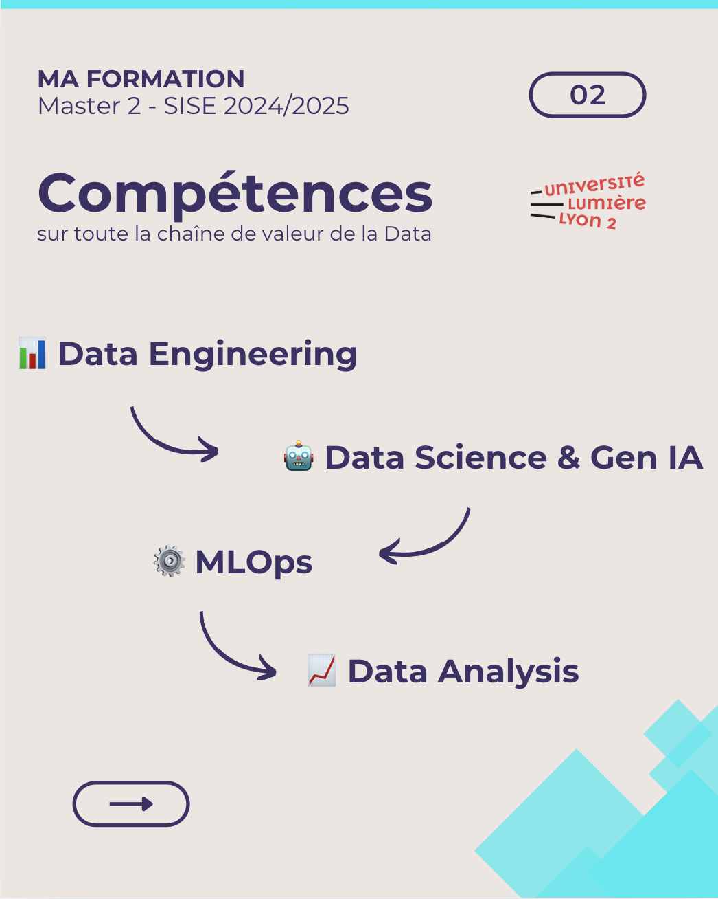

 # Bienvenue sur mon profil GitHub !

Je suis étudiant à l'Université Lumière Lyon 2 en Master 2 - SISE (Statistiques et Informatique pour la Science des Données). Ce Master m'a permit d'acquérir toutes les compétences nécessaires pour évoluer dans le monde de la Data. 

    

Fort de 5 années d'expériences en tant qu'ostéopathe, j'ai acquis de nombreuses compétences dans la prise en charge des troubles musculo-squelletiques et des données de santé de manière générale. J'ai décidé de me spécialiser dans l'analyse de données et l'intelligence artificielle pour répondre aux enjeux de la santé de demain. 

Vous trouverez sur mon profil différents projets réalisés dans le cadre de mon Master2 - SISE. Mais également des projets réalisés dans le cadre de mon stage. (A venir)

## Compétences 

- **Langages de programmation** : Python, R, SQL

- **Data Analysis** : Data Viz (Tableau, PowerBI, Qlik)

- **Data Science** : Machine learning, Deep learning, Natural Language Processing, Computer Vision

- **MLOps** : Déploiement, automatisation et gestion des cyles de machine learning, Docker, MLFlow, Airlow

- **Data Engineering** : Création de pipeline de données, gestion d'ETL (Extract, Transform, Load), gestion de grands volumes de données

- **IA générative** : Création de pipeline RAG

## Contact

Vous pouvez me contacter via :

- **LinkedIn** : [Profil LinkedIn](in/pierre-bourbon-7b6b7012a)
- **Email** : bourbonpierre@outlook.fr

---

